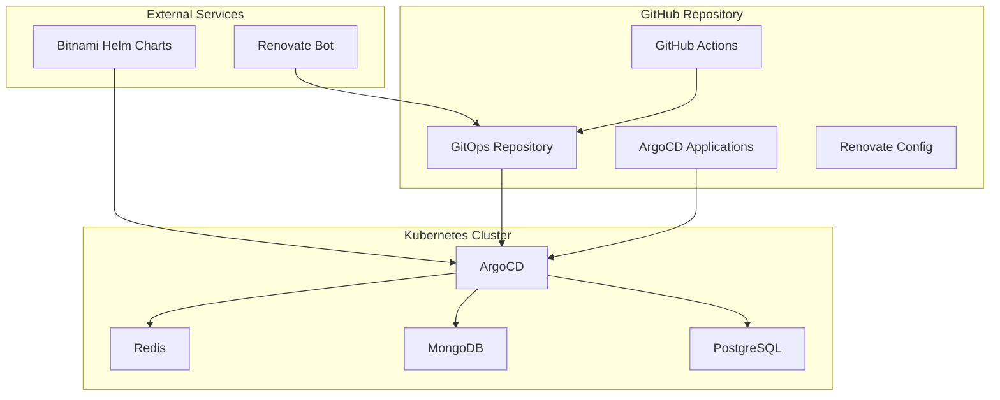
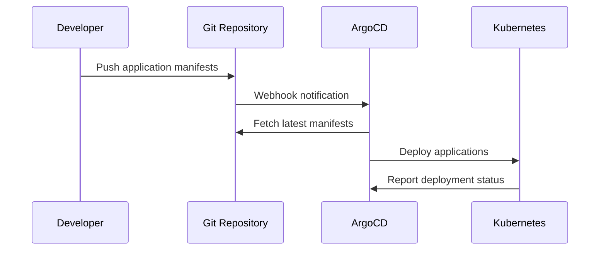
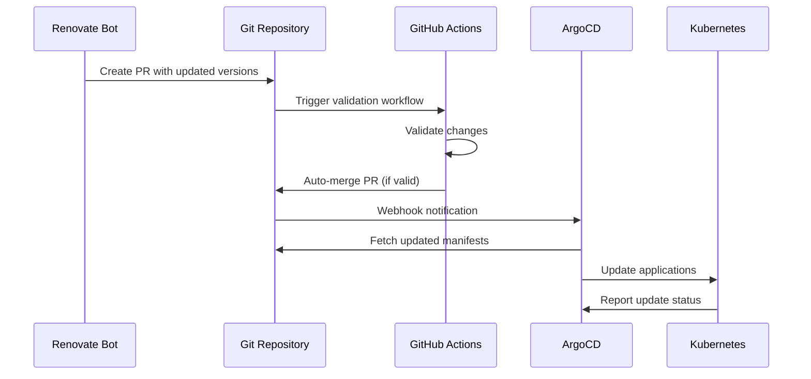

# Architecture Overview

This document provides a detailed overview of the GitOps PoC architecture,
components, and their interactions.

## High-Level Architecture



## Component Details

### 1. GitOps Repository

The GitOps repository serves as the single source of truth for all application configurations.

**Structure:**

```text
├── argocd-applications/   # ArgoCD application manifests
├── .github/               # GitHub configuration
│   ├── workflows/         # GitHub Actions
│   └── renovate.json      # Renovate configuration
└── docs/                  # Documentation
```

**Key Files:**

- `argocd-applications/app-of-apps.yaml`: Root application managing all others
- `argocd-applications/*.yaml`: Individual application definitions

### 2. ArgoCD

ArgoCD is the GitOps continuous delivery tool that monitors the repository and keeps
the cluster in sync.

**Configuration:**

- **Sync Policy**: Automated with prune and self-heal enabled
- **Source**: Git repository with Helm charts
- **Destination**: Kubernetes cluster namespaces
- **Retry Policy**: 5 retries with exponential backoff

**Features Used:**

- Application of Applications pattern
- Automated synchronization
- Health monitoring
- Rollback capabilities

### 3. Applications

Three Bitnami Helm charts are deployed to demonstrate different types of applications:

#### PostgreSQL (Bitnami Charts Secure)

- **Purpose**: Relational database
- **Namespace**: `app-postgresql`
- **Features**: Persistence, authentication, resource limits
- **Access**: ClusterIP service on port 5432

#### MongoDB (Bitnami Charts Secure)

- **Purpose**: Document database
- **Namespace**: `app-mongodb`
- **Features**: Standalone mode, persistence, authentication
- **Access**: ClusterIP service on port 27017

#### Redis (Bitnami Charts Secure)

- **Purpose**: In-memory data store
- **Namespace**: `app-redis`
- **Features**: Standalone mode, persistence, authentication
- **Access**: ClusterIP service on port 6379

### 4. Renovate Bot

Renovate Bot automatically detects and proposes updates for Helm chart versions.

**Configuration:**

- **Schedule**: Weekly on Mondays before 6 AM
- **Scope**: Bitnami Helm charts only
- **Grouping**: All Bitnami updates in single PR
- **Auto-merge**: Enabled for patch and minor updates
- **Manual Review**: Required for major updates

**Update Process:**

1. Renovate scans repository for chart versions
2. Checks for newer versions in Bitnami repository
3. Creates PR with updated versions
4. GitHub Actions validates the changes
5. Auto-merge or manual review based on update type

### 5. GitHub Actions

Two workflows provide CI/CD functionality:

#### Renovate PR Validation

- **Trigger**: Pull requests from Renovate Bot
- **Validation**: Helm chart availability, YAML syntax, breaking changes
- **Auto-merge**: Conditional based on update type
- **Reporting**: Detailed validation reports

#### General CI

- **Trigger**: All pushes and pull requests
- **Validation**: ArgoCD applications, Helm values, template rendering
- **Security**: Trivy vulnerability scanning
- **Documentation**: Markdown syntax validation

## Data Flow

### 1. Initial Deployment



### 2. Automated Updates



## Security Considerations

### 1. Repository Security

- **Access Control**: GitHub repository permissions
- **Branch Protection**: Required status checks
- **Secret Management**: GitHub Secrets for sensitive data

### 2. Cluster Security

- **RBAC**: Service accounts with minimal permissions
- **Network Policies**: Isolated namespaces (optional)
- **Security Contexts**: Non-root containers
- **Resource Limits**: CPU and memory constraints

### 3. Application Security

- **Authentication**: Strong passwords for databases
- **Encryption**: TLS for sensitive communications
- **Vulnerability Scanning**: Trivy integration
- **Image Security**: Bitnami's security-hardened images

## Scalability Considerations

### 1. Horizontal Scaling

- **Application Replicas**: Configurable via Helm values
- **Load Balancing**: Kubernetes services
- **Ingress**: NGINX ingress controller

### 2. Vertical Scaling

- **Resource Requests**: Minimum resource allocation
- **Resource Limits**: Maximum resource consumption
- **Auto-scaling**: HPA configuration (optional)

### 3. Storage Scaling

- **Persistent Volumes**: Dynamic provisioning
- **Storage Classes**: Configurable storage backends
- **Volume Expansion**: Support for volume growth

## Monitoring and Observability

### 1. ArgoCD Monitoring

- **Application Health**: Built-in health checks
- **Sync Status**: Real-time synchronization status
- **Event Logging**: Detailed event history
- **Metrics**: Prometheus metrics (optional)

### 2. Application Monitoring

- **Health Endpoints**: Custom health checks
- **Logging**: Structured logging
- **Metrics**: Application-specific metrics
- **Tracing**: Distributed tracing (optional)

### 3. Infrastructure Monitoring

- **Cluster Health**: Node and pod status
- **Resource Usage**: CPU, memory, storage
- **Network**: Service and ingress monitoring
- **Security**: Vulnerability and compliance scanning

## Disaster Recovery

### 1. Backup Strategy

- **Git Repository**: GitHub's built-in backup
- **Application Data**: Persistent volume backups
- **Configuration**: ArgoCD application state
- **Secrets**: Kubernetes secret management

### 2. Recovery Procedures

- **Cluster Recovery**: Kind/k3d cluster recreation
- **Application Recovery**: ArgoCD application sync
- **Data Recovery**: Persistent volume restoration
- **Configuration Recovery**: Git repository restoration

## Best Practices

### 1. GitOps Principles

- **Declarative**: All configuration in Git
- **Versioned**: Git history for all changes
- **Automated**: Continuous synchronization
- **Observable**: Clear audit trail

### 2. Helm Best Practices

- **Values Management**: Separate values files
- **Version Pinning**: Specific chart versions
- **Template Validation**: Helm template testing
- **Security**: Non-root containers

### 3. ArgoCD Best Practices

- **App of Apps**: Hierarchical application management
- **Sync Policies**: Automated synchronization
- **Health Checks**: Comprehensive health monitoring
- **Rollback**: Quick rollback capabilities

## Future Enhancements

### 1. Multi-Environment Support

- **Development**: Separate namespace
- **Staging**: Validation environment
- **Production**: Production-ready configuration
- **Promotion**: Automated promotion pipeline

### 2. Advanced Monitoring

- **Prometheus**: Metrics collection
- **Grafana**: Visualization dashboards
- **AlertManager**: Alert management
- **Jaeger**: Distributed tracing

### 3. Security Hardening

- **Network Policies**: Micro-segmentation
- **Pod Security Standards**: Enhanced security
- **Image Scanning**: Continuous vulnerability scanning
- **Compliance**: Regulatory compliance checks

### 4. Automation Enhancements

- **ChatOps**: Slack/Teams integration
- **Approval Workflows**: Multi-stage approvals
- **Testing**: Automated testing pipelines
- **Documentation**: Auto-generated documentation
