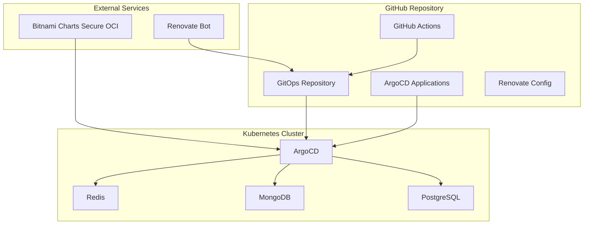

# Architecture Overview

This document provides a detailed overview of the GitOps PoC architecture,
components, and their interactions.

## High-Level Architecture



## Component Details

### 1. GitOps Repository

The GitOps repository serves as the single source of truth for all application configurations.

**Structure:**

```text
├── argocd-applications/   # ArgoCD application manifests
├── .github/               # GitHub configuration
│   ├── workflows/         # GitHub Actions
│   └── renovate.json      # Renovate configuration
└── docs/                  # Documentation
```

**Key Files:**

- `argocd-applications/app-of-apps.yaml`: Root application managing all others
- `argocd-applications/*.yaml`: Individual application definitions

### 2. ArgoCD

ArgoCD is the GitOps continuous delivery tool that monitors the repository and keeps
the cluster in sync.

**Configuration:**

- **Sync Policy**: Automated with prune and self-heal enabled
- **Source**: Git repository with Helm charts
- **Destination**: Kubernetes cluster namespaces
- **Retry Policy**: 5 retries with exponential backoff

**Features Used:**

- Application of Applications pattern
- Automated synchronization
- Health monitoring
- Rollback capabilities

### 3. Applications

Three Bitnami Helm charts are deployed to demonstrate different types of applications:

#### PostgreSQL (Bitnami Charts Secure)

- **Purpose**: Relational database
- **Namespace**: `app-postgresql`
- **Features**: Persistence, authentication, resource limits
- **Access**: ClusterIP service on port 5432

#### MongoDB (Bitnami Charts Secure)

- **Purpose**: Document database
- **Namespace**: `app-mongodb`
- **Features**: Standalone mode, persistence, authentication
- **Access**: ClusterIP service on port 27017

#### Redis (Bitnami Charts Secure)

- **Purpose**: In-memory data store
- **Namespace**: `app-redis`
- **Features**: Standalone mode, persistence, authentication
- **Access**: ClusterIP service on port 6379

### 4. Renovate Bot

Renovate Bot automatically detects and proposes updates for Helm chart versions.

**Update Process:**

1. Renovate scans repository for chart versions
2. Checks for newer versions in Bitnami repository
3. Creates PR with updated versions
4. GitHub Actions validates the changes

### 5. GitHub Actions

Two workflows provide CI/CD functionality:

#### Renovate PR Validation

- **Trigger**: Pull requests from Renovate Bot
- **Validation**: Helm chart availability, YAML syntax, breaking changes
- **Reporting**: Detailed validation reports

#### General CI

- **Trigger**: All pushes and pull requests
- **Validation**: ArgoCD applications, Helm values, template rendering
- **Security**: Trivy vulnerability scanning
- **Documentation**: Markdown syntax validation
